
# Parameter Efficicent Fine-Tuning
- [Overview](#overview)
- [what is PEFT ?](#parameter-efficient-fine-tuning-peft)
- [Practical Use-case](#practical-use-case)
- [PEFT Methods](#peft-methods)
    - [1. Prompt Modifications](#1-prompt-modifications)
        - [Soft Prompt Tuning](#soft-prompt-tuning)
        - [Soft Prompt Tuning vs Prompt Engineering](#soft-prompt-vs-prompting)
        - [Prefix Tuning](#prefix-tuning)
    - [2. Adapters](#2-adapters)
        - [Soft Tuning vs Prefix Tuning vs Adapters](#soft-tuning-vs-prefix-tuning-vs-adapters)
        - [What is an Adapter Module?](#what-is-an-adapter-module)
        - [How to decide the value of ***m***?](#how-to-decide-the-value-of-m)
        - [LLaMA-Adapters](#llama-adapters)
    - [3. Low Rank Adaptation (LoRA)](#low-rank-adaptationlora)
        - [The Idea Behind Low-Rank Adaptation](#the-idea-behind-low-rank-adaptation)
        - [LoRA Hyperparameters](#lora-hyperparameters)

## Overview:
- Fine-tuning of large pre-trained models on downstream tasks is called “transfer learning”.
- While full fine-tuning pre-trained models on downstream tasks is a common, effective approach, it is an inefficient approach to transfer learning.
- The simplest way out for efficient fine-tuning could be to freeze the networks’ lower layers and adapt only the top ones to specific tasks.
- In this article, we’ll explore Parameter Efficient Fine-Tuning (PEFT) methods that enable us to adapt a pre-trained model to downstream tasks more efficiently – in a way that trains lesser parameters and hence saves cost and training time, while also yielding performance similar to full fine-tuning.

[Back to Top](#top)

## Parameter-Efficient Fine-Tuning (PEFT)
- Parameter-Efficient Fine-Tuning (PEFT) in the context of Large Language Models (LLMs) refers to a set of techniques used to fine-tune a pre-trained model on specific tasks or datasets while only updating a small subset of the model's parameters. This approach is aimed at reducing the computational cost and memory requirements associated with training large models. Instead of updating all the parameters, PEFT methods typically involve modifying only a few strategic parameters or adding small, trainable modules to the pre-existing network, thereby preserving the general capabilities of the model while adapting it to new tasks. This makes the fine-tuning process more efficient and accessible, especially for applications with limited resources.
- The challenge is this: modern pre-trained models (like BERT, GPT, T5, etc.) contain hundreds of millions, if not billions, of parameters. Fine-tuning all these parameters on a downstream task, especially when the available dataset for that task is small, can easily lead to overfitting. The model may simply memorize the training data instead of learning genuine patterns. Moreover, introducing additional layers or parameters during fine-tuning can drastically increase computational requirements and memory consumption.
- PEFT allows to only fine-tune a small number of model parameters while freezing most of the parameters of the pre-trained LLM.

[Back to Top](#top)

## Practical Use-case
- PEFT obviates the need for 40 or 80GB A100s to make use of powerful LLMs. In other words, you can fine-tune 10B+ parameter LLMs for your desired task for free or on cheap consumer GPUs.
- Using PEFT methods like LoRA, especially 4-bit quantized base models via QLoRA, you can fine-tune 10B+ parameter LLMs that are 30-40GB in size on 16GB GPUs. 
- If you’re fine-tuning on a single task, the base models are already so expressive that you need only a few (~10s-100s) of examples to perform well on this task. With PEFT via LoRA, you need to train only a trivial fraction (in this case, 0.08%), and though the weights are stored as 4-bit, computations are still done at 16-bit.
- ***Key takeaway:*** You can fine-tune powerful LLMs to perform well on a desired task using free compute. Use a <10B parameter model, which is still huge, and use quantization, PEFT, checkpointing, and provide a small training set, and you can quickly fine-tune this model for your use case.

[Back to Top](#top)

## PEFT Methods
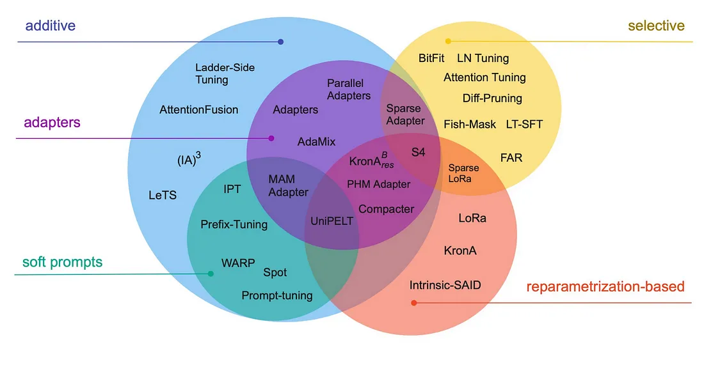

### 1. Prompt Modifications:
#### **Soft Prompt Tuning:**
- First introduced in the [The Power of Scale for Parameter-Efficient Prompt Tuning](https://aclanthology.org/2021.emnlp-main.243.pdf); this paper by Lester et al. introduces a simple yet effective method called soft prompt tuning, which prepends a trainable tensor to the model’s input embeddings, essentially creating a soft prompt to condition frozen language models to perform specific downstream tasks. Unlike the discrete text prompts, soft prompts are learned through backpropagation and can be fine-tuned to incorporate signals from any number of labeled examples.
- Soft prompt tuning only requires storing a small task-specific prompt for each task, and enables mixed-task inference using the original pre-trained model.
- The authors show that prompt tuning outperforms few-shot learning by a large margin, and becomes more competitive with scale.
- This is an interesting approach that can help to effectively use a single frozen model for multi-task serving.
- Model tuning requires making a task-specific copy of the entire pre-trained model for each downstream task and inference must be performed in separate batches. Prompt tuning only requires storing a small task-specific prompt for each task, and enables mixed-task inference using the original pretrained model. With a T5 “XXL” model, each copy of the tuned model requires 11 billion parameters. By contrast, our tuned prompts would only require 20,480 parameters per task—a reduction of over five orders of magnitude – assuming a prompt length of 5 tokens.
- Thus, instead of using discrete text prompts, prompt tuning employs soft prompts. Soft prompts are learnable and conditioned through backpropagation, making them adaptable for specific tasks.

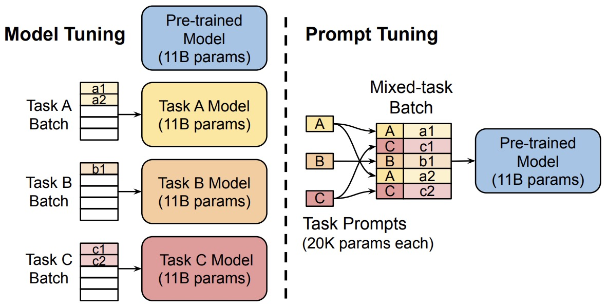

 

### **In Other words:**
Soft prompts are a way to tell a large language model (LLM) what to do, but without using any words. Instead, the LLM is trained on a set of examples, and then learns to recognize the patterns in those examples. These patterns are then used to create a soft prompt, which is a string of numbers that represents the patterns.

___soft prompts are a powerful tool for adapting LLMs to new tasks, especially for tasks where there is limited training data available.___

Esxample:
Imagine that you want to train an LLM to write poems. You could start by giving the LLM a set of example poems. The LLM would then learn to recognize the patterns in those poems, such as the rhyme scheme, the meter, and the subject matter. 

 

Once the LLM has learned the patterns in the example poems, you could create a soft prompt by extracting the patterns from the examples. This soft prompt could then be used to guide the LLM to write its own poems.

 

The LLM would not be able to read the soft prompt, but it would be able to recognize the patterns in the soft prompt and use those patterns to generate creative text.

The format of a soft prompt for the above example could be a string of numbers that represent the rhyme scheme, the meter, and the subject matter of the example poems. For example, the following soft prompt could be used to guide the LLM to write a poem about love:

`[ABAB rhyme scheme], [iambic tetrameter], [love]`

This soft prompt tells the LLM to write a poem with an ABAB rhyme scheme, in iambic tetrameter, and about the subject of love.

 

### Soft Prompt vs. Prompting:

**Prompting:** 
- involves creating specific input prompts to guide the model's responses. These prompts are non-trainable and consist solely of plain text that contextualizes or specifies the task for the model.

- Used to elicit specific types of responses from a pre-trained model without modifying the model itself.

**Advantages:**
- No additional training required.
- Can be quickly implemented for various tasks.
- Highly flexible.

**Disadvantages**
- Effectiveness depends on the skill of the person crafting the prompts.
- Results may lack consistency.
- Often requires trial and error to find effective prompts.

 

**Soft Prompt Tuning:**
- involves appending trainable parameters (soft prompts) to the model's input, which are optimized during a training phase to improve performance on specific tasks.

- Adapts a model to new tasks or enhances its performance in specific domains while keeping the core model weights unchanged.

**Advantages:**
- More systematic than manual prompting.
- The model learns to perform tasks during the tuning process, potentially leading to better performance.

**Disadvantages:**
- Requires computational resources for training the soft prompts.
- The effectiveness is contingent upon the number of trainable parameters and the initial quality of the model.

---- 

In Prompt Engineering we work on the language of our prompt to achieve better completion results. This process requires manual work and the prompt is limited by context window size.

in Soft Prompt Tuning, we add a trainable token to the input prompt. The added prompt must be same length as the original language token provided to the LLM. Then, the supervised learning algorithm trains the newly added prompts. In many cases, 20–100 tokens are enough to achieve a performance boost. It is important to note that the original weights of model are frozen, and only the new prompts are trained as part of this process.

--- 
- Soft prompt tuning and prompting a model with extra context are both methods designed to guide a model’s behavior for specific tasks, but they operate in different ways. Here’s how they differ:

1. **Mechanism:**
    - **Soft Prompt Tuning:** This involves introducing trainable parameters (soft prompts) that are concatenated or added to the model’s input embeddings. These soft prompts are learned during the fine-tuning process and are adjusted through backpropagation to condition the model to produce desired outputs for specific tasks.
    - **Prompting with Extra Context:** This method involves feeding the model with handcrafted or predefined text prompts that provide additional context. There’s no explicit fine-tuning; instead, the model leverages its pre-trained knowledge to produce outputs based on the provided context. This method is common in few-shot learning scenarios where the model is given a few examples as prompts and then asked to generalize to a new example.
2. **Trainability:**
    - **Soft Prompt Tuning:** The soft prompts are trainable. They get adjusted during the fine-tuning process to optimize the model’s performance on the target task.
    - **Prompting with Extra Context:** The prompts are static and not trainable. They’re designed (often manually) to give the model the necessary context for the desired task.
3. **Use Case:**
    - **Soft Prompt Tuning:** This method is particularly useful when there’s a need to adapt a pre-trained model to various downstream tasks without adding significant computational overhead. Since the soft prompts are learned and optimized, they can capture nuanced information necessary for the task.
    - **Prompting with Extra Context:** This is often used when fine-tuning isn’t feasible or when working with models in a zero-shot or few-shot setting. It’s a way to leverage the vast knowledge contained in large pre-trained models by just guiding their behavior with carefully crafted prompts.

 

[Back to Top](#top)

### Prefix Tuning:
- Proposed in [Prefix-Tuning: Optimizing Continuous Prompts for Generation](https://arxiv.org/abs/2101.00190), prefix-tuning is a lightweight alternative to fine-tuning for natural language generation tasks, which keeps language model parameters frozen, but optimizes a small continuous task-specific vector (called the prefix).
- Instead of adding a soft prompt to the model input, it prepends trainable parameters to the hidden states of all transformer blocks. During fine-tuning, the LM’s original parameters are kept frozen while the prefix parameters are updated.
- Prefix-tuning draws inspiration from prompting, allowing subsequent tokens to attend to this prefix as if it were “virtual tokens”.
- The figure below from the paper shows that fine-tuning (top) updates all Transformer parameters (the red Transformer box) and requires storing a full model copy for each task. They propose prefix-tuning (bottom), which freezes the Transformer parameters and only optimizes the prefix (the red prefix blocks). Consequently, prefix-tuning only need to store the prefix for each task, making prefix-tuning modular and space-efficient. Note that each vertical block denote transformer activations at one time step.

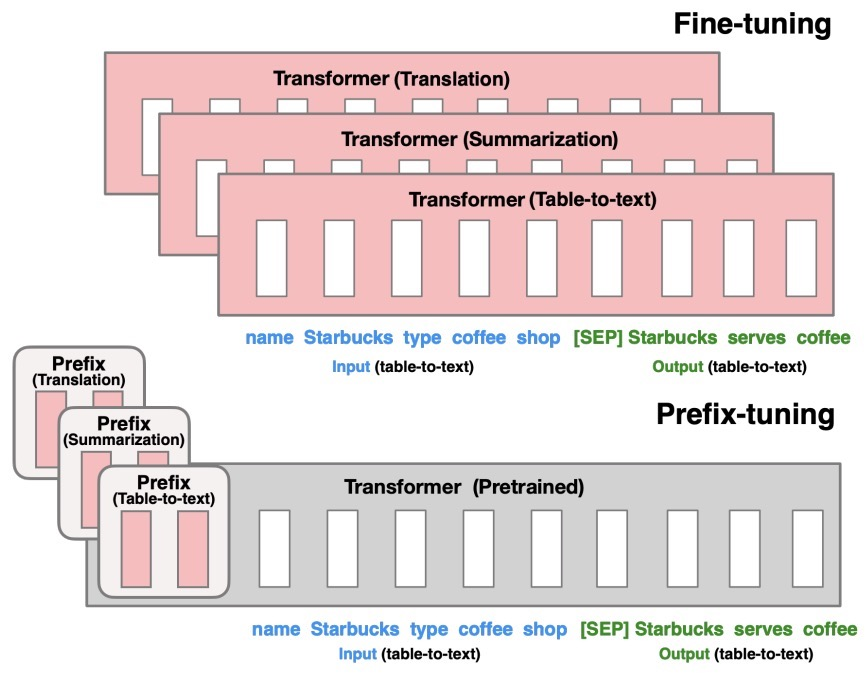

---

### **In Other Words:**
- Prefix tuning is a technique aiming to streamline the process. Instead of relying on manual prompt engineering, it focuses on learning a continuous prompt that can be seamlessly optimized end-to-end. This learned prompt, when added to the model’s input, acts as a guiding beacon, providing the necessary context to steer the model’s behavior in alignment with the specific task at hand. It’s like giving the model a customized set of instructions without the hassle of intricate manual tweaking, making the entire process more efficient and dynamic. It also doesn’t require training multiple parameters from the model, training only less than 1000× the parameters of the model.
- prefix tuning prepends a learned continuous vector to the input. For example, in summarization, a prefix would be prepended to the input document. The prefix is tuned to steer the model to perform summarization while keeping the large pretrained model fixed. This is much more efficient, requiring tuning only 0.1% of the parameters compared to full fine-tuning.
- Prefix tuning draws inspiration from prompting methods like in GPT-3, but optimizes a continuous prefix vector rather than using discrete tokens. The paper shows prefix tuning can match the performance of full fine-tuning on table-to-text and summarization tasks, while using 1000x fewer parameters per task.

#### How Prefix Tuning works:
Prefix Tuning essentially prepends a learned continuous vector, called the prefix, to the input of the pretrained model.

 

Let’s take an example. Imagine we are prefix-tuning a Large Language Model (LLM) for Hate Speech Classification. The model takes an input x tweet and generates an output y which is the classification “Hate” or “Non-Hate”.

 

In prefix tuning, we’re doing a simple yet clever move — mixing x and y into a single sequence, let’s call it z = [x; y]. Why? Well, this combo creates a kind of “encoder-like” function. It’s super handy for tasks where y depends on x. It’s called Conditional Generation. This way, the model can smoothly go back and forth between x and y using its self-attention skills.
Moving along in the process, we introduce a prefix vector, let’s call it u, which is placed at the beginning of our sequence z, resulting in the concatenated form [u; x; y].

 

The prefix vector u is a matrix with dimensions (prefix_length × d), where d denotes the hidden dimension size. To put it into perspective, consider a scenario with a prefix length of 10 and a hidden size of 1024. In this case, the prefix would house a total of 10,240 tunable parameters.

This unified sequence is then systematically input into the Transformer model in an autoregressive manner. The model engages in attentive computations, focusing on prior tokens within the sequence z to predict the subsequent token. Specifically, the model computes hi, representing the current hidden state, as a function of zi and the past activations within its left context. This approach ensures the Transformer’s ability to progressively anticipate the upcoming tokens in the sequence.

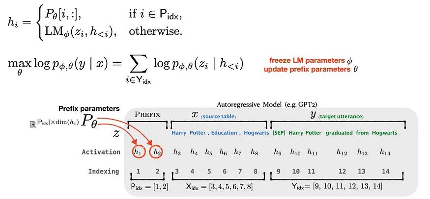

--- 

- **Embedding Modification:** In Prefix Tuning, a series of task-specific vectors, or "prefixes," are prepended to the input embeddings of the sequence that is fed into the model. These prefixes are learnable parameters that are optimized during training.
- **Task Adaptation:** By training these prefix embeddings, the model can adapt to a new task without altering its core architecture or the bulk of its pre-trained weights. The trained prefixes essentially guide the model's attention and processing pathways to generate more appropriate responses for the specific task.

### **Usage:**
- **Fine-Tuning Alternative:** Prefix Tuning is used as an alternative to full model fine-tuning when there are constraints on computational resources or when model stability must be maintained across updates.
- **Specialized Tasks:** It is particularly useful for specialized tasks where only a subset of the model's behavior needs to be modified, such as task-specific classification, generation tasks, or adapting to new domains with limited data.

### **Advantages:**
- **Efficiency:** It requires less memory and computational power compared to fine-tuning the entire model, as only a small number of parameters are trained.
- __Flexibility:__ Prefixes can be easily swapped out for different tasks without interfering with the model's underlying capabilities.
- __Preservation of Generalization:__ By keeping most of the model's weights fixed, Prefix Tuning preserves the generalization abilities learned during pre-training.

### __Disadvantages__:
- **Limited Scope:** Since only a small part of the model is adapted, the changes it can make are less dramatic than those possible through full model fine-tuning.
- **Dependency on Pre-Trained Model Quality:** The effectiveness of Prefix Tuning heavily depends on the quality and versatility of the underlying pre-trained model.

 

[Back to Top](#top)

### 2. Adapters:
- Adapter layers, often termed “Adapters”, add minimal additional parameters to the pretrained model. These adapters are inserted between existing layers of the network.
- Adapters is a PEFT technique shown to achieve similar performance as compared to tuning the top layers while requiring as fewer parameters as two orders of magnitude.
- Adapter-based tuning simply inserts new modules called “adapter modules” between the layers of the pre-trained network.
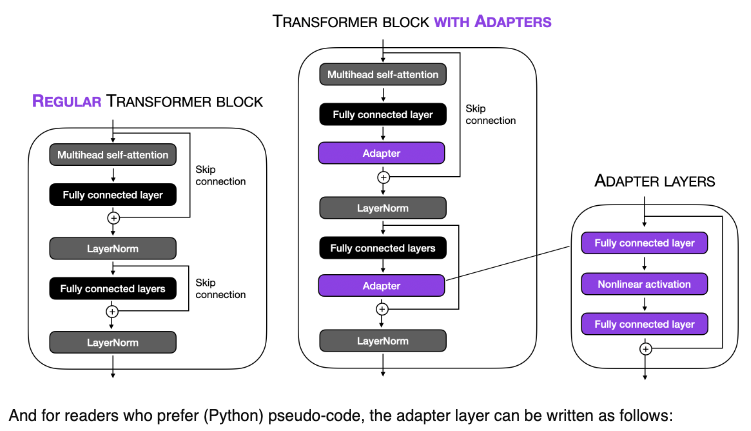 

#### [image source](https://sebastianraschka.com/blog/2023/llm-finetuning-llama-adapter.html)
---
- During fine-tuning, only the parameters of these adapter layers are updated, while the original model parameters are kept fixed. This results in a model with a small number of additional parameters that are task-specific.
- Keeping the full PT model frozen, these modules are the only optimizable ones while fine-tuning – this means only a very few parameters are introduced per task yielding “compact” models.
- They offer many benefits such as:
    - Parameter-Efficiency: By keeping the main model frozen and only updating the adapter layers, a minimal number of parameters are added per task. This results in compact models that are memory-efficient.
    - Performance: Despite the small parameter footprint, adapters often achieve performance comparable to conventional fine-tuning.
- The adapter module consists of two fully connected layers with a bottleneck structure. This structure is inspired by autoencoders, which are designed to encode information into a compressed representation and then decode it back to its original form.
- Here’s how the parameter efficiency is achieved:
    1. **Bottleneck Structure:** The first layer of the adapter reduces the dimensionality of the input (e.g., from 1024 to 24 dimensions). This drastic reduction means that the information from the original 1024 dimensions must be compressed into just 24 dimensions. The second layer then projects these 24 dimensions back to the original 1024 dimensions.
    2. **Reduction in Parameters:** This bottleneck approach significantly reduces the number of parameters. In your example, the total number of parameters introduced by the adapter is 49,152 (from the computation 1024x24 + 24x1024). If we were to use a single fully connected layer to project a 1024-dimensional input to a 1024-dimensional output directly, it would require 1,048,576 parameters (1024x1024).
    3. **Efficiency Analysis:** By using the adapter approach, the number of parameters is substantially lower. Comparing 49,152 parameters to 1,048,576 parameters shows a dramatic reduction, making the adapter much more efficient in terms of parameter usage.
    4. **Why is this Beneficial?:** This efficiency is particularly beneficial when fine-tuning large pre-trained models. Instead of retraining or adapting the entire network (which would be computationally expensive and memory-intensive), adapters allow for targeted adjustments with far fewer additional parameters. This makes the process more manageable and practical, especially when resources are limited.
- The adapter’s bottleneck structure allows it to achieve similar functionality (adapting the model to new tasks or data) as a full-sized layer would, but with a significantly reduced number of parameters. This efficiency makes adapters a popular choice for fine-tuning large pre-trained models in a resource-effective manner.

 

### What is an Adapter Module?

- Let’s look at the application of the adapter module in the transformer architecture in three points:
    - The adapter module (right) first projects the original d-dimensional features into a smaller m-dimensional vector, applies a non-linearity, and then projects it back to d-dimensions.
    - As can be seen, the module features a skip-connection - With it in place, when the parameters of the projection layers are initialized to near-zero which eventually leads to near identity initialization of the module. This is required for stable fine-tuning and is intuitive as with it, we essentially do not disturb the learning from pre-training.
    - In a transformer block (left), the adapter is applied directly to the outputs of each of the layers (attention and feedforward).

### How to decide the value of ***m***?
- The size `m` in the Adapter module determines the no. of optimizable parameters and hence poses a parameter vs performance tradeoff.
- The original paper experimentally investigates that the performance remains fairly stable across varying Adapter sizes m and hence for a given model a fixed size can be used for all downstream tasks.
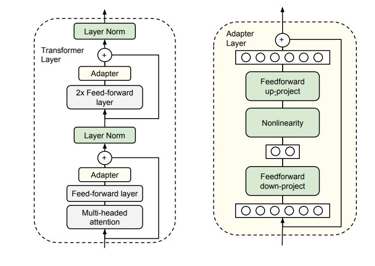

 

### [LLaMA-Adapters](https://arxiv.org/abs/2303.16199)
- This paper introduces an efficient fine-tuning method called LLaMA-Adapter. This method is designed to adapt the LLaMA model into an instruction-following model with high efficiency in terms of resource usage and time. Key aspects of this paper include:
    1. **Parameter Efficiency:** LLaMA-Adapter introduces only 1.2 million learnable parameters on top of the frozen LLaMA 7B model, which is significantly fewer than the full 7 billion parameters of the model. This approach leads to a more efficient fine-tuning process both in terms of computational resources and time, taking less than one hour on 8 A100 GPUs.
    2. **Learnable Adaption Prompts:** The method involves appending a set of learnable adaption prompts to the input instruction tokens in the higher transformer layers of LLaMA. These prompts are designed to adaptively inject new instructions into the frozen LLaMA while preserving its pre-trained knowledge, effectively guiding the subsequent contextual response generation.
    3. **Zero-initialized Attention Mechanism:** To avoid disturbances from randomly initialized adaption prompts, which can harm fine-tuning stability and effectiveness, the paper proposes a zero-initialized attention mechanism with a learnable gating factor. This mechanism allows for a stable learning process and progressive incorporation of instructional signals during training. It ensures that the newly acquired instructional signals are effectively integrated into the transformer while retaining the pre-trained knowledge of LLaMA.
    4. **Generalization and Multi-modal Reasoning:** LLaMA-Adapter is not only effective for language tasks but can also be extended to multi-modal instructions, allowing for image-conditioned LLaMA models. This capability enables superior reasoning performance on benchmarks like ScienceQA and COCO Caption. Additionally, the approach has demonstrated strong generalization capacity in traditional vision and language tasks.
- In summary, the LLaMA-Adapter represents a significant advancement in the field of parameter-efficient fine-tuning of large language models. Its innovative use of learnable adaption prompts and zero-initialized attention mechanism provides a highly efficient method for adapting pre-trained models to new tasks and domains, including multi-modal applications.
- The image below ([source](https://sebastianraschka.com/blog/2023/llm-finetuning-llama-adapter.html)) illustrates this concept below.

 

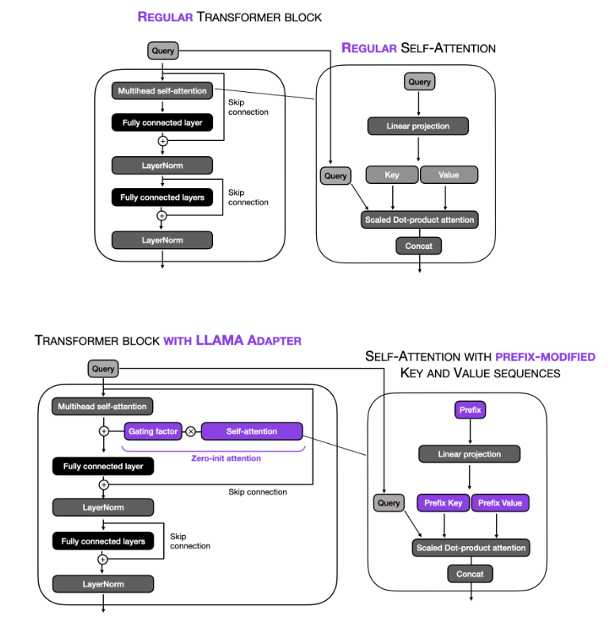
--- 
### Soft Tuning vs Prefix Tuning vs Adapters
- **Soft Tuning:**
often referred to as prompt tuning or in-context learning, involves crafting specific prompts that guide the model's behavior. This method leverages the pre-trained knowledge of the model by inserting example inputs and outputs directly into the prompt. It's a form of zero-shot or few-shot learning where the model generates responses based on the context provided in the prompt. This technique does not alter the model's underlying weights, making it computationally efficient and quick to implement for new tasks, especially when model adaptation needs to be lightweight or when data is scarce.
- **Prefix Tuning:**
is a method where fixed, task-specific parameters are prepended to the inputs during the training phase. These prefixed parameters, which are learned and optimized, act as a sort of "soft prompt" that adjusts the activation pathways within the model. Unlike soft tuning, prefix tuning involves actual training of these prefixed parameters while keeping the main model weights frozen. This allows for more customized control over the model’s outputs than soft tuning, catering to more complex requirements without the need for extensive retraining.
- **Adapters:** 
involve adding small trainable modules between the layers of an existing pre-trained model. These adapter layers are trained on a specific task while the original pre-trained weights of the model remain unchanged. This method is more invasive than soft or prefix tuning because it modifies the model's architecture with additional parameters. However, it is still more efficient than retraining the entire model. Adapters are particularly useful for tasks that require significant deviation from the model's base training but still benefit from leveraging the underlying large-scale pre-trained network.

[Back to Top](#top)

 

### Low Rank Adaptation(LoRA)
- **Essence:**
    - Low Rank Adaptation (LoRA) simplifies the fine-tuning of large models by decomposing complex, high-dimensional weight matrices into lower-dimensional forms. This technique, akin to methods like PCA and SVD, allows for the retention of critical information while significantly reducing the size and complexity of the weights, thus enhancing fine-tuning efficiency on resource-constrained settings.
- **Application:**
    - LoRA identifies key dimensions in the original weight matrix of neural networks, optimizing these reduced dimensions to maintain the model’s learning capabilities with less computational cost. It adds trainable low-rank matrices to the model’s architecture, specifically to the Transformer layers, and optimizes these matrices instead of the entire model, leading to fewer trainable parameters and reduced memory requirements.
- **Benefits:**
    - This approach offers considerable time and memory efficiency, as a large portion of the model’s parameters are kept frozen, reducing both training time and GPU memory requirements. It also avoids additional inference latency and facilitates easy task-switching during deployment, requiring changes only in a small subset of weights.
- **In Summary:**
    - LoRA represents a smart balance in model fine-tuning, preserving the core strengths of large pre-trained models while adapting them efficiently for specific tasks or datasets. It’s a technique that redefines efficiency in the world of massive language models.

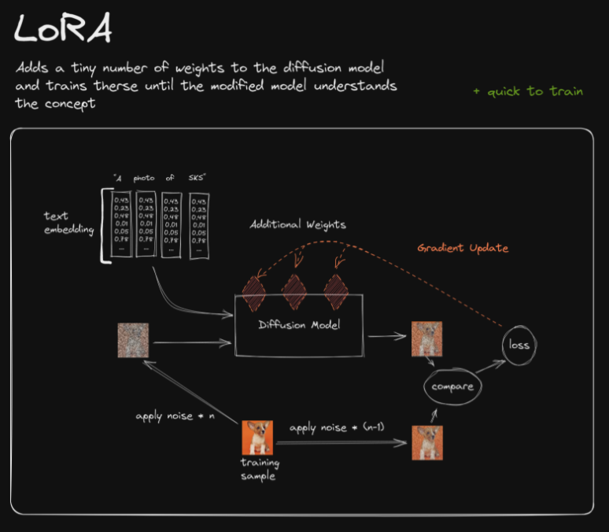

 

### The Idea Behind Low-Rank Adaptation
- The overall idea and concept are related to principal component analysis (PCA) and singular vector decomposition (SVD), where we approximate a high-dimensional matrix or dataset using a lower-dimensional representation. In other words, we try to find a (linear) combination of a small number of dimensions in the original feature space (or matrix) that can capture most of the information in the dataset.

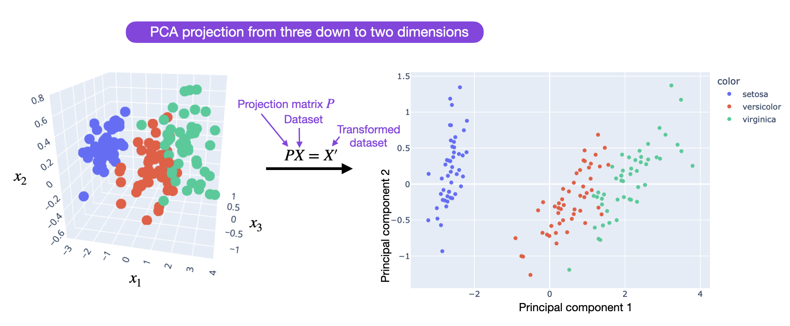

 

- Before we continue, let’s recap by taking a quick look at traditional finetuning vs. LoRA with the images ([source](https://sebastianraschka.com/blog/2023/llm-finetuning-lora.html)) below:

 

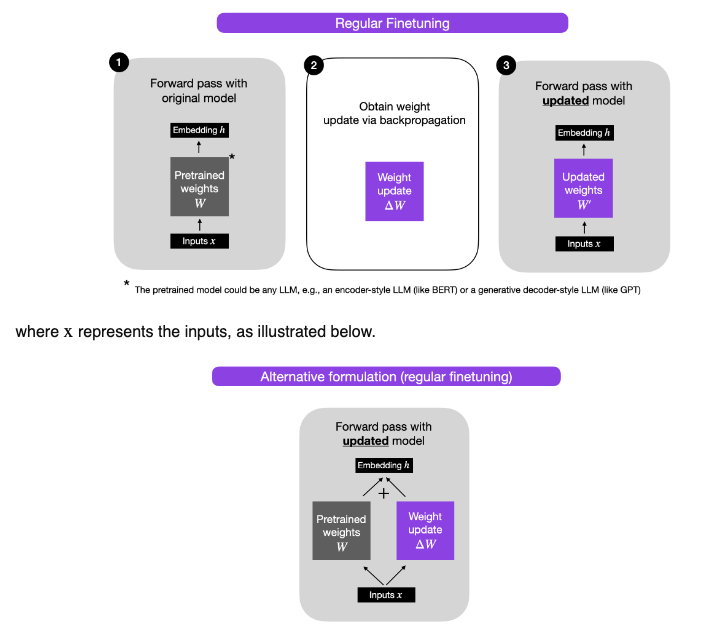

 

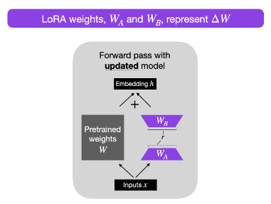

> LoRA efficiently fine-tunes large-scale neural networks by introducing trainable low-rank matrices, simplifying the model’s complexity while retaining its robust learning capabilities.

 

### LoRA Hyperparameters
- LoRA is particularly useful in situations where fine-tuning all parameters of a large model is computationally expensive or when the amount of available training data is limited. The core idea behind LoRA is to introduce trainable low-rank matrices that adapt the pre-trained weights of a model without directly modifying them. Here are the key hyperparameters associated with LoRA:
    1. **Rank (`r`):** This is arguably the most important hyperparameter in LoRA. The rank of the adaptation matrices determines the balance between the model’s capacity and the number of additional parameters introduced. A higher rank increases the model’s capacity to learn the desired task (i.e., domain adapt) from new data but also increases the number of parameters and computational cost. Finding the optimal rank usually requires experimentation.
    2. **Learning Rate:** While not unique to LoRA, the learning rate for the LoRA parameters is crucial. It might be beneficial to set a different learning rate for the LoRA parameters compared to the rest of the model, especially if the base model’s parameters are frozen.
    3. **Weight Decay:** This hyperparameter controls the regularization of the LoRA parameters. Adjusting weight decay can help prevent overfitting, especially when the dataset is small or the model is particularly large.
    4. **Initialization Scale (α):** The scale at which the low-rank matrices are initialized can affect the adaptation process. Proper initialization helps in starting the training process from a good point, which can lead to better performance.
    5. **Training Epochs:** The number of epochs to train the LoRA adaptation. Since LoRA involves training fewer parameters than the entire model, it might converge faster, so the optimal number of epochs might be different from standard full-model fine-tuning.
    6. **Batch Size:** The size of the batches used during training can influence the model’s performance and convergence speed. Batch size can affect the stability and quality of the gradient estimates, which are crucial when adapting a model using LoRA.
- These hyperparameters can significantly impact the effectiveness of LoRA in adapting pre-trained models to new tasks or datasets. The optimal settings for these hyperparameters can vary depending on the specific task, the size of the dataset, and the architecture of the base model being adapted. Experimentation and validation on a development dataset are often required to find the best combination of hyperparameters for a given application.
- **More resources**:
    1. [sebastianraschka](https://sebastianraschka.com/blog/2023/llm-finetuning-lora.html).
    2. [Improving LoRA](https://magazine.sebastianraschka.com/p/lora-and-dora-from-scratch)

[video: Low-Rank Adaptation - LoRA explained](https://youtu.be/X4VvO3G6_vw?si=4nKzRXZ-vSghEqJS)

[Back to Top](#top)