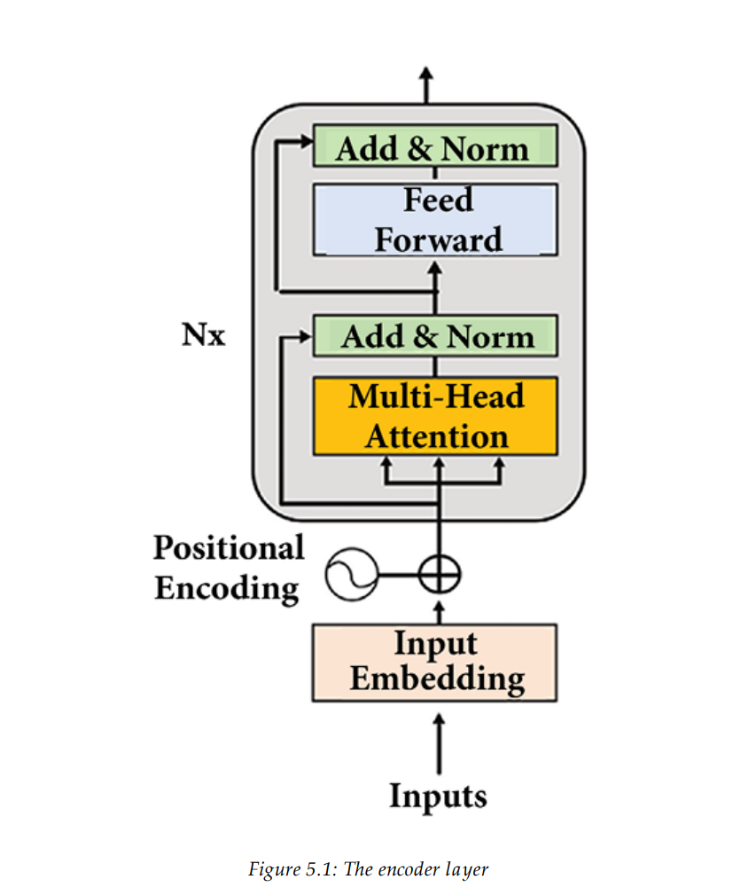
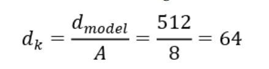
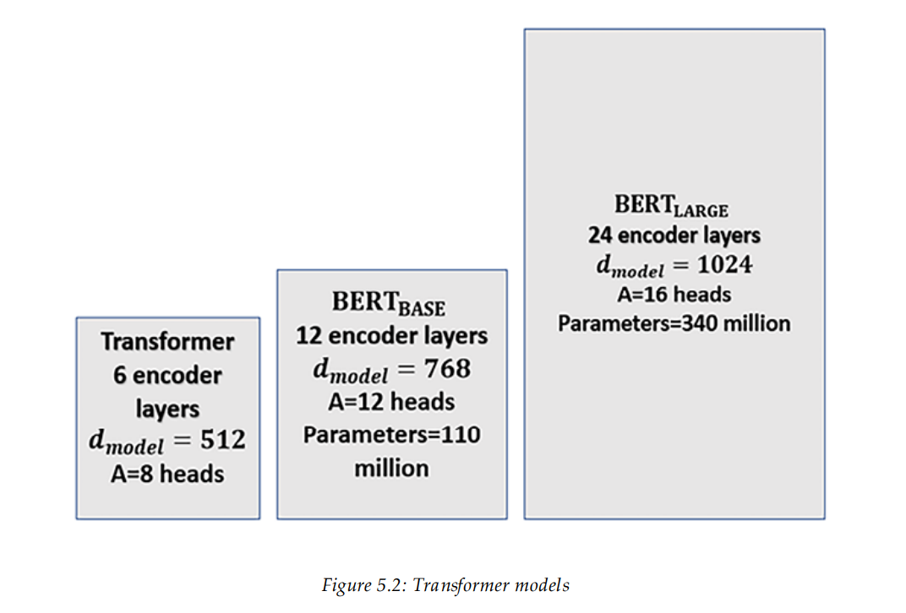
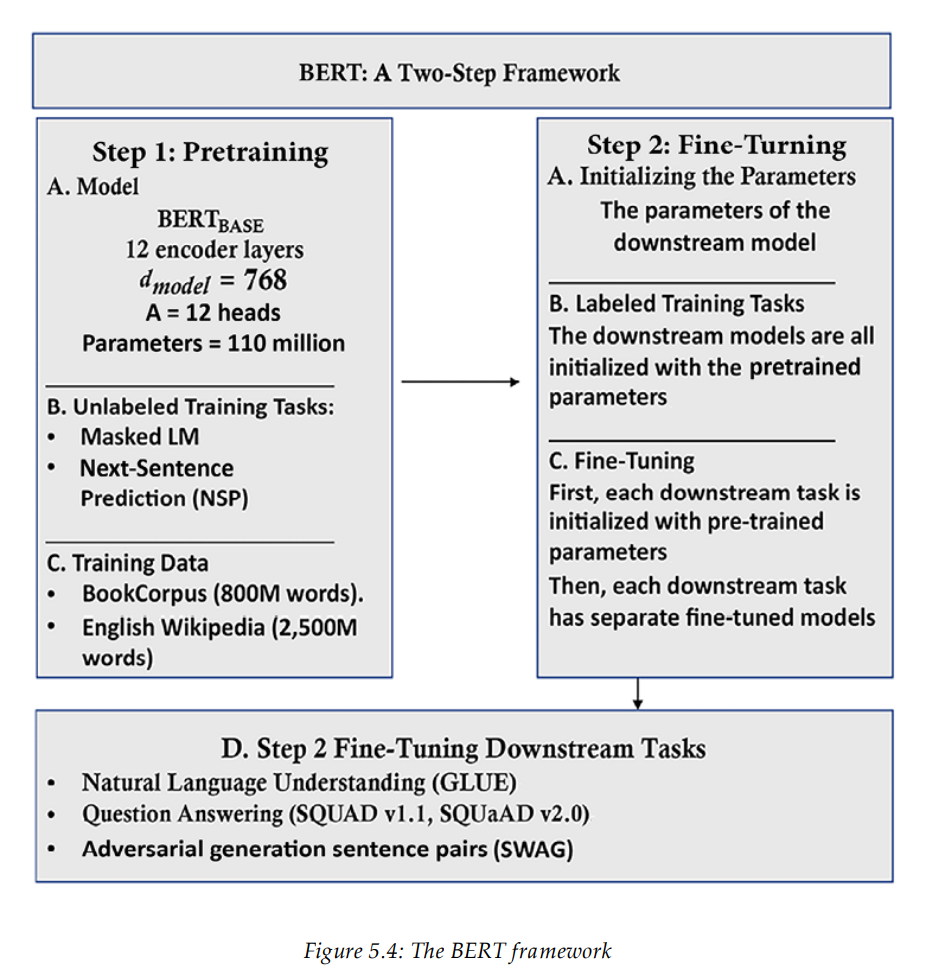

- ### **Bidirectional Encoder Representations from Transformers (BERT).**
#### ___BERT___: only uses the blocks of the encoders of the Transformer in a novel way and does not use the decoder stack. 

#### 1. The Encoder stack:

- #### BERT  model uses __Masked Language Modeling (MLM)__ in which some input tokens are hidden (“masked”), and the attention layers must learn to understnad the context. The model will predict the hidden tokens. 

 

#### - Original Transformer contains:
1. #### a stack of `N = 6` layers.
2. #### The number of dimensions of the Original Transformer: `d_model = 512`
3. #### The number of of attention heads of the Orginal Transformer is `A = 8`

 

#### - BERT BASE:
1. #### a stack of `N = 12` layers.
2. #### The number of dimensions of the Original Transformer: `d_model = 768`
3. #### The number of of attention heads of the Orginal Transformer is `A = 12`
4. #### The dimension of each head `Z_A` remains 64 as in the Original Transformer.

#### - BERT LARGE:
1. #### a stack of `N = 24` layers.
2. #### The number of dimensions of the Original Transformer: `d_model = 1024`
3. #### The number of of attention heads of the Orginal Transformer is `A = 16`
4. #### The dimension of each head `Z_A` remains 64 as in the Original Transformer.

 

- #### The sizes of the models can be summed up as follows:

 

#### - bidirectional method enables BERT to understand the context on both sides of each token.

### - ___Masked Language modeling:___
#### MLM does not require training a model with a sequence of visible words followed by a masked sequence to predict. BERT introduces the bidirectional analysis of a sentence with a random mask on a word of the sentence.

 
A potential input sequence could be:

`The cat sat on it because it was a nice rug.`  

The decoder could potentially mask the anntention after the model reachs the word `it`: 
`The cat sat on it <masked sequence>.`

But the BERT encoder masks a random token to make a prediction,
which makes it more powerful:

`The cat sat on it [MASK] it was a nice rug.`

###### -  The input tokens were masked in a tricky way to force the model to
train longer but produce better results with three methods:

1. ##### Surprise the model by not masking a single token on 10% of the dataset; for example: `The cat sat on it [because] it was a nice rug.`

2. #### Surprise the model by replacing the token with a random token on 10% of the dataset; for example: `The cat sat on it [often] it was a nice rug.`

3. #### Replace a token with a [MASK] token on 80% of the dataset; for example: `The cat sat on it [MASK] it was a nice rug.`

 

### __Next-sentence predction:__
- #### BERT uses Next-Sentence Prediction (NSP) as a method for training, where input includes two sentences with a [CLS] token for binary classification and a [SEP] token for sequence separation.

#### - [cls] is a binary classification token added to the beginning of the first sequence to predict if the second sequence follows the first sequence. A positive sample is usually a pair of consecutive sentences taken from a dataset. A negative sample is created using sequences from different documents.

#### - [SEP] is a separation token that signals the end of a sequence, such as a sentence, sentence part, or question, depending on the task at hand.

 

### Pretraining and fine-tuning a BERT model: 

 

# Byte-Pair Encoding (BPE) Tokenizer

## Overview
The Byte-Pair Encoding (BPE) tokenizer is a hybrid between character-based and word-based tokenization. It is particularly effective in dealing with rare words or words not seen during training by breaking them down into more frequent subwords.

## How it Works
1. **Initialization**: Start by treating each character or byte as a symbol and count the frequency of all pairs of adjacent symbols.
2. **Pair Merging**: Repeatedly merge the most frequent pairs to form new symbols, iteratively until a desired vocabulary size is reached.
3. **Vocabulary Building**: Each new symbol is added to the vocabulary, enabling the model to handle common sequences as single units.

## Example
Given the sentence "This is a test.", the BPE tokenizer might process it as follows:
- Initial Symbols: `T h i s _ i s _ a _ t e s t .`
- Frequent Pairs: Merge `i` and `s`, `t` and `e`, `s` and `t`
- Resulting Vocabulary: `T`, `h`, `is`, `a`, `te`, `st`, `.`, `_`
- Tokenized Output: `This is a test .`

## Benefits
- **Efficiency**: Efficiently handles large vocabularies by breaking down infrequent words into subwords.
- **Flexibility**: Adapts well to new words or symbols not seen during training.
